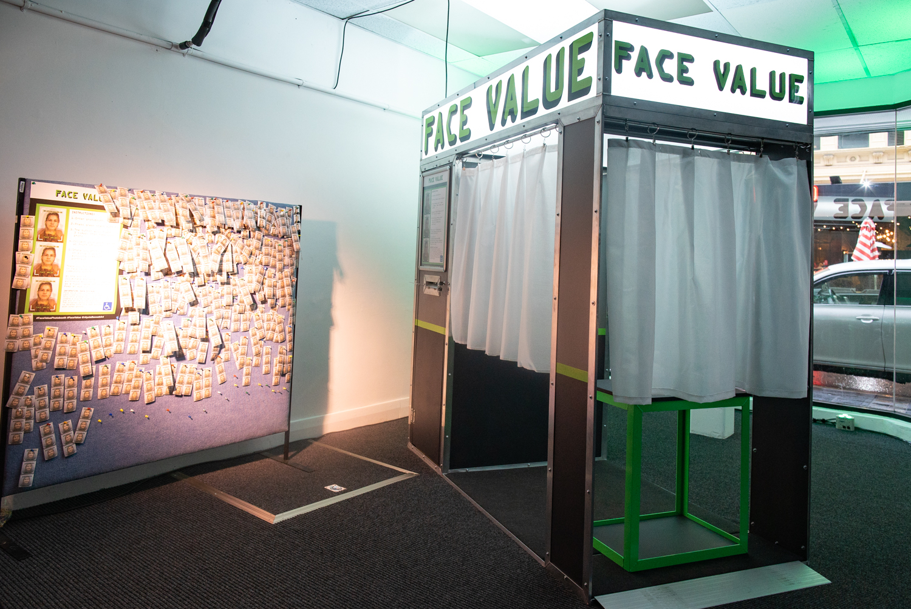

# Face Value
## Introduction
This is the code for an art installation I did for Illuminate Adelaide 2022 in collaboration with Alycia Bennet. The installation was a photobooth called "Face Value" that would average the faces of everyone who came through it, and print out a moving community average rather than an individual's face alone. It uses OpenCV and dlib to create the facial average from the photos, and ran on a Raspberry Pi 4. I didn't document the code much as I was the only one working on it.

Here is a video of the faces evolving over the period the project was installed. There is a change after the first day, this is because I tweaked the software in response to user feedback that the image didn't appear to be changing very much. This makes it more of a moving average than a strict mean of all faces, but carries across the intention of the artwork better.

## Build instructions
You can use Cmake to build this project.
run `cmake -S ./src -B ./build`
then `cmake --build ./build`
then `./build/photobooth_process`

## Usage
I can't remember the exact details of how it was deployed originally. The software can be used to process images live as the user presses the button, or it can be used to average a list of pre-existing images.          
